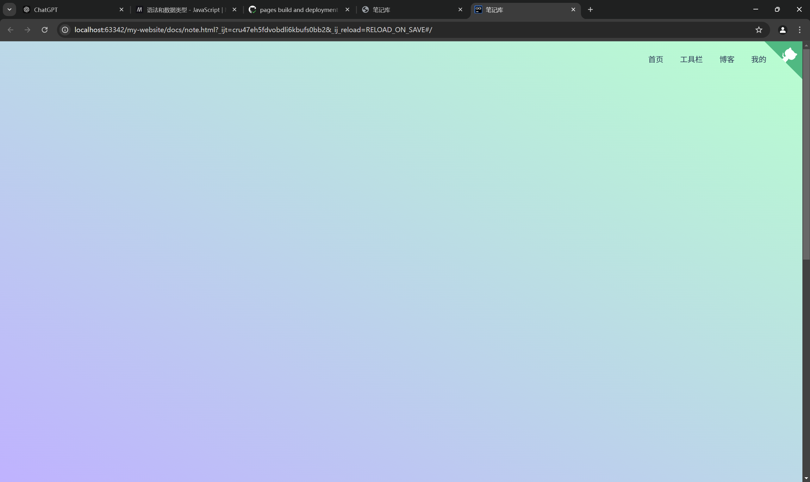
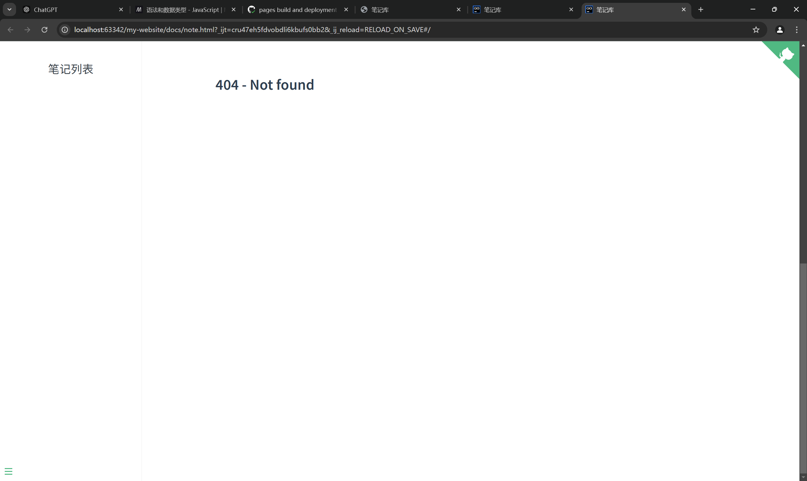
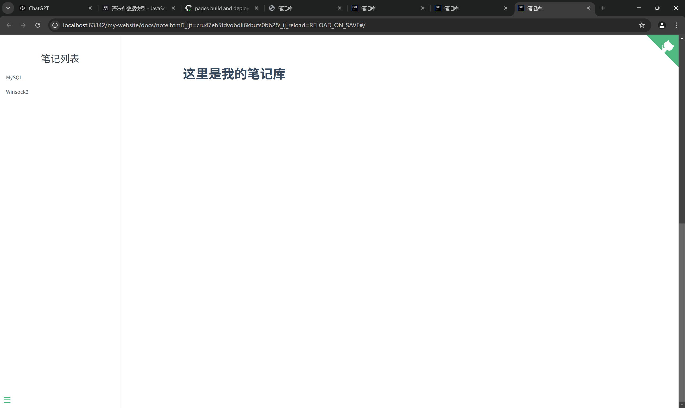

# 记录

## 背景

我在使用docsify完成笔记库页面，并部署到github page时，发生了一件棘手的事

## 问题

在本地上测试docsify首页，能正常运行。但是部署到github page上时，所有在docs文件夹下被docsify首页使用，以下划线开头的md文件(比如"_coverpage.md")，都不能被docsify首页正常使用，导致封面、侧边栏目录无内容等问题。

可以看到下方明显没加载_coverpage.md



_home.md也没加载




## 原因

本问题的发生主要是因为github page在建立网页时不会加载下划线开头的文件，导致docsify不能正常使用这些文件。

docsify的封面md，侧边栏md等文件默认以下划线开头的本意是为了标识这些资源用于内部用途，不应当作普通资源加载，刚好与github page的机制冲突。

## 解决方案

将这些特殊文件的下划线去掉，然后在docsify的window.$docsify下显性地指定应该加载哪个md。


假设我们去掉下划线之后的**目录结构**如下：

```shell
my-website
│
├── index.html         // 首页
└── docs/               // 其他页面
    ├── index.html      // 引用 MD 文件的页面
    ├── coverpage.md  // 封面md
    ├── home.md        // 首页md
    ├── sidebar.md    // 侧边栏md
    └── [其他 md 文件]

```


然后我们把特殊位置所需的md路径重新指定到重命名后的md：

```javascript
window.$docify = {
    coverpage: "./coverpage.md",
    homepage: "./home.md",
    loadSidebar: "./sidebar",
}
```

这样问题就解决了，再次部署发现页面已能正常使用


